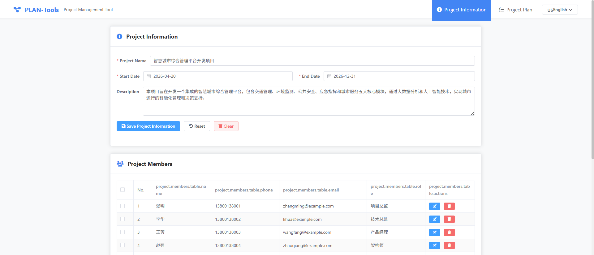
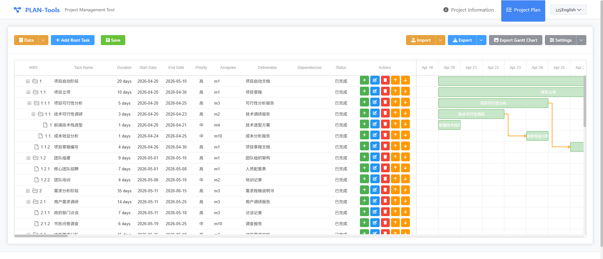

# PLAN-Tools - 项目计划管理软件


**一个功能强大的前端项目计划管理工具，支持项目信息管理、任务计划编制和甘特图可视化**

[在线演示](http://120.26.107.17/pt1) • [快速开始](#快速开始) • [功能特性](#功能特性) • [贡献指南](#贡献指南)

[English Version](./README_EN.md)

***

## 项目简介

PLAN-Tools 是一个纯前端的项目计划管理软件，无需后端服务即可使用。它提供了完整的项目管理功能，包括项目信息管理、任务计划编制和甘特图可视化展示。所有数据都存储在浏览器的 localStorage 中，确保数据安全且易于管理。

## 演示截图

### 中文界面

#### 项目信息管理


#### 甘特图可视化


### English Interface

#### Project Information Management



#### Gantt Chart Visualization



## 功能特性

### 🌍 多语言支持 (Internationalization)

- **中英文切换** - 支持中文和英文界面语言切换
- **默认语言** - 默认使用英文界面
- **持久化存储** - 语言选择自动保存，下次打开自动应用
- **完整国际化** - 所有界面元素、表单、对话框、消息提示均支持多语言
- **导出国际化** - 导出的 Excel、Markdown、CSV 文件使用当前选择的语言
- **动态切换** - 实时切换语言，无需刷新页面

### 📋 项目信息管理

- 项目基本信息管理（名称、开始/结束日期、描述）
- 项目团队成员管理（姓名、电话、邮箱、角色）
- 支持导入/导出项目信息（JSON、Excel 格式）

### ✅ 项目计划管理

- **层级任务结构** - 支持父子任务的树形结构
- **WBS 自动编号** - 自动生成工作分解结构编号
- **任务属性管理** - 名称、日期、工期、交付物、依赖关系
- **任务分配** - 从项目成员中选择任务负责人
- **优先级设置** - 高/中/低三个级别
- **状态跟踪** - 待办/进行中/已完成
- **任务操作** - 新增、编辑、删除、排序、层级调整
- **可自定义显示** - 用户可自定义显示的任务字段

### 📊 甘特图可视化

- 直观的任务时间线展示
- 支持拖拽调整任务时间和工期
- 任务依赖关系可视化（箭头连接）
- 支持导出为 PNG 图片

### 💾 数据导入/导出

- **JSON 格式** - 完整数据交换和备份
- **Excel 格式** - 与电子表格软件兼容
- **Markdown 格式** - 生成项目文档
- **PNG 格式** - 甘特图图片导出

## 技术栈

| 技术                                                            | 版本    | 说明                                   |
| ------------------------------------------------------------- | ----- | ------------------------------------ |
| [Vue 3](https://vuejs.org/)                                   | 3.4+  | 渐进式 JavaScript 框架，使用 Composition API |
| [Vite](https://vitejs.dev/)                                   | 5.2   | 新一代前端构建工具                            |
| [Pinia](https://pinia.vuejs.org/)                             | 2.1+  | Vue 官方状态管理库                          |
| [Vue Router](https://router.vuejs.org/)                       | 4.3+  | Vue.js 官方路由管理器                       |
| [Vue I18n](https://vue-i18n.intlify.dev/)                     | 9.9+  | Vue.js 国际化插件                         |
| [Element Plus](https://element-plus.org/)                     | 2.6+  | 基于 Vue 3 的组件库，支持国际化                |
| [Tailwind CSS](https://tailwindcss.com/)                      | 3.4+  | 实用优先的 CSS 框架                         |
| [dhtmlx-gantt](https://dhtmlx.com/docs/products/dhtmlxGantt/) | 8.0+  | 专业的 JavaScript 甘特图库                  |
| [XLSX](https://www.npmjs.com/package/xlsx)                    | 0.18+ | Excel 文件处理库                          |
| [Day.js](https://day.js.org/)                                 | 1.11+ | 轻量级日期处理库                             |
| [Sortable.js](https://sortablejs.github.io/Sortable/)         | 1.15+ | 拖拽排序库                                |
| [Font Awesome](https://fontawesome.com/)                      | 6.5+  | 图标库                                  |

## 快速开始

### 环境要求

- Node.js >= 16.0.0
- npm >= 8.0.0 或 pnpm >= 7.0.0

### 安装依赖

```bash
# 使用 npm
npm install

# 或使用 pnpm
pnpm install
```

### 启动开发服务器

```bash
npm run dev
```

应用将在 <http://localhost:5173> 自动启动并在浏览器中打开。

### 构建生产版本

```bash
npm run build
```

构建产物将输出到 `dist/` 目录。

### 预览生产构建

```bash
npm run preview
```

### 运行测试

```bash
# 手动测试
# 在浏览器中打开 tests/test-iframe.html 并点击"运行所有测试"

# 单元测试
npm run test:unit

# E2E 测试
npm run test:e2e
```

详细的测试指南请参阅 [tests/TESTING.md](tests/TESTING.md)

### 代码质量

```bash
# ESLint 检查并自动修复
npm run lint

# Prettier 格式化
npm run format
```

## 项目结构

```
PLAN-Tools/
├── docs/                      # 项目文档和截图
│   ├── run_pic.png            # 演示截图
│   ├── run_pic2.png           # 甘特图截图
│   ├── alipay.png             # 支付宝收款码
│   ├── 技术规范.md
│   ├── 需求文档.md
│   └── 页面原型.md
├── tests/                     # 测试文件
│   ├── TESTING.md             # 测试报告
│   ├── MANUAL-TEST.md         # 手动测试指南
│   ├── test-iframe.html       # 快速测试页面
│   ├── test-suite.html        # 测试套件
│   ├── test-app.cjs           # Node.js 测试脚本
│   ├── test-app.py            # Python 测试脚本
│   └── ...                    # 其他测试辅助文件
├── src/
│   ├── assets/                # 静态资源
│   │   └── main.css          # 全局样式
│   ├── components/            # Vue 组件
│   │   ├── ProjectInfo/      # 项目信息管理组件
│   │   │   ├── ProjectInfoForm.vue
│   │   │   └── MemberManager.vue
│   │   ├── ProjectPlan/      # 项目计划管理组件
│   │   │   ├── Toolbar.vue
│   │   │   ├── TaskList.vue
│   │   │   ├── TaskForm.vue
│   │   │   ├── DisplaySettingsDialog.vue
│   │   │   └── GanttColumnSettingsDialog.vue
│   │   ├── GanttChart/       # 甘特图组件
│   │   │   └── GanttChart.vue
│   │   └── common/           # 通用组件
│   │       └── LanguageSwitcher.vue  # 语言切换器
│   ├── locales/              # 国际化翻译文件
│   │   ├── en.json           # 英文翻译
│   │   ├── zh-CN.json        # 中文翻译
│   │   └── index.js          # i18n 配置
│   ├── data/                 # 模拟数据
│   │   ├── mock.js
│   │   └── mock-enhanced.js
│   ├── router/               # 路由配置
│   │   └── index.js
│   ├── store/                # Pinia 状态管理
│   │   ├── project.js        # 项目信息状态
│   │   ├── tasks.js          # 任务状态
│   │   └── ui.js             # UI 状态和语言设置
│   ├── utils/                # 工具函数
│   │   ├── export.js         # 数据导出（支持国际化）
│   │   ├── import.js         # 数据导入
│   │   ├── wbs.js            # WBS 编号生成
│   │   ├── date.js           # 日期处理
│   │   └── tasks.js          # 任务辅助函数
│   ├── views/                # 页面视图
│   │   ├── ProjectInfoView.vue
│   │   └── ProjectPlanView.vue
│   ├── App.vue               # 根组件
│   └── main.js               # 应用入口
├── .eslintrc.js              # ESLint 配置
├── .prettierrc               # Prettier 配置
├── .gitignore                # Git 忽略配置
├── index.html                # HTML 入口
├── package.json              # 项目配置
├── tailwind.config.js        # Tailwind CSS 配置
├── vite.config.js            # Vite 配置
└── README.md                 # 项目说明
```

## 核心功能说明

### 状态管理

项目使用 Pinia 进行状态管理，包含三个核心 store：

- **`store/project.js`** - 管理项目基本信息和团队成员
- **`store/tasks.js`** - 管理任务树和显示设置
- **`store/ui.js`** - 管理 UI 状态（分割面板比例、语言设置等）

### 数据持久化

所有数据自动保存到浏览器的 localStorage：

- `plan-tools-project` - 项目信息和团队成员
- `plan-tools-tasks` - 任务数据和显示设置
- `plan-tools-ui` - UI 状态配置（分割面板比例、语言设置）
- `plan-tools-locale` - 用户选择的语言偏好

### WBS 编号规则

WBS（工作分解结构）编号自动生成，格式如下：

```
1         # 顶级任务
1.1       # 二级任务
1.1.1     # 三级任务
2         # 另一个顶级任务
2.1       # 2 的子任务
```

## 使用指南

### 切换界面语言

1. 在页面顶部导航栏找到语言切换器
2. 点击语言选择器，选择：
   - 🇺🇸 English - 切换到英文界面
   - 🇨🇳 中文 - 切换到中文界面
3. 语言选择会自动保存，下次打开应用时使用该语言
4. 导出的 Excel、Markdown、CSV 文件会使用当前选择的语言

### 创建新项目

1. 访问 **项目信息管理** 页面
2. 填写项目基本信息（名称、日期、描述）
3. 添加项目团队成员
4. 保存项目信息

### 编制项目计划

1. 访问 **项目计划管理** 页面
2. 点击 **新增任务** 创建任务
3. 填写任务信息：
   - 任务名称
   - 开始/结束日期或工期
   - 交付物
   - 任务依赖
   - 负责人
   - 优先级和状态
4. 使用 **层级调整** 按钮创建父子任务关系
5. 使用 **排序** 按钮调整任务顺序
6. 点击 **保存** 生成 WBS 编号

### 导出项目

项目支持多种导出格式：

- **JSON** - 完整项目数据备份
- **Excel** - 生成电子表格
- **Markdown** - 生成项目文档
- **PNG** - 导出甘特图图片

## 在线演示

访问 <http://120.26.107.17/pt1> 查看在线演示。

## 浏览器支持

| 浏览器     | 支持版本  |
| ------- | ----- |
| Chrome  | 最新版 ✅ |
| Firefox | 最新版 ✅ |
| Safari  | 最新版 ✅ |
| Edge    | 最新版 ✅ |

## 开发指南

详细的开发指南请参阅 [docs/DEVELOPMENT-GUIDE.md](docs/DEVELOPMENT-GUIDE.md)

### 添加新功能

1. 在对应组件中添加 UI
2. 在 store 中添加状态管理
3. 在 utils 中添加工具函数（如需要）
4. 更新文档

### 代码规范

项目使用 ESLint 和 Prettier 进行代码检查和格式化：

```bash
# 自动修复代码问题
npm run lint

# 格式化代码
npm run format
```

## 贡献指南

欢迎提交 Issue 和 Pull Request！

### 提交 Issue

请在 Issue 中详细描述：

- Bug 复现步骤
- 预期行为和实际行为
- 截图（如适用）
- 环境信息（浏览器、操作系统等）

### 提交 Pull Request

1. Fork 本项目
2. 创建特性分支 (`git checkout -b feature/AmazingFeature`)
3. 提交更改 (`git commit -m 'Add some AmazingFeature'`)
4. 推送到分支 (`git push origin feature/AmazingFeature`)
5. 创建 Pull Request

## ☕ 请我喝杯咖啡

如果您觉得这个项目对您有帮助，欢迎请我喝杯咖啡！您的支持是我持续开发和维护项目的动力。

<br />

### 支付宝打赏


**感谢您的支持！** 🙏

<br />

## 许可证

本项目采用 [MIT](LICENSE) 许可证。

##

***


**Made with ❤️ by the PLAN-Tools team**

[⬆ 返回顶部](#plan-tools---项目计划管理软件)

