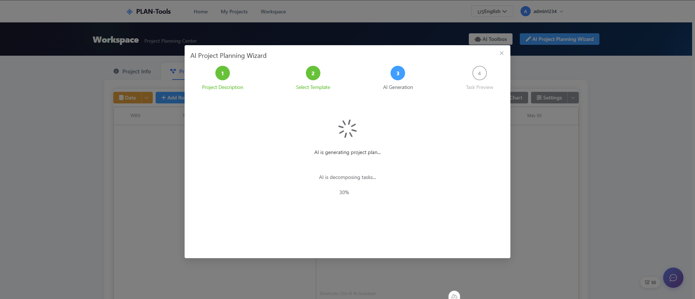
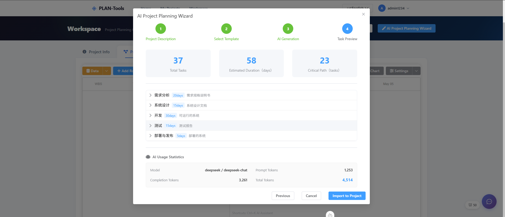
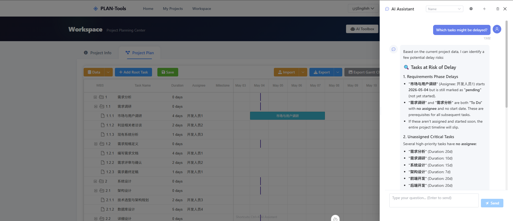
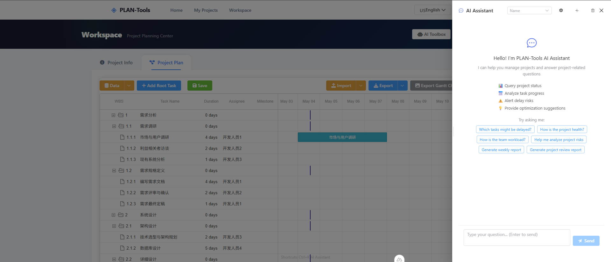
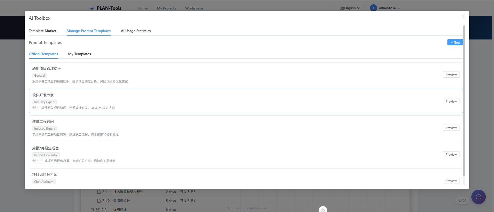

# PLAN-Tools - AI-Powered Project Planning Tool

<br />


**AI-powered smart planning, win from the start — Describe what you want to do in one sentence, AI automatically breaks down tasks, generates plans, and outputs Gantt charts**

[Live Demo](http://120.26.107.17/aiplan) • [Quick Start](#quick-start) • [Features](#features) • [Contributing](#contributing)

[中文文档](./README_CN.md)

<br />

***

## Introduction

PLAN-Tools is an AI-powered project planning application built on Nuxt 3 full-stack architecture. It provides comprehensive project management features including AI-driven task decomposition, project information management, task planning, and Gantt chart visualization. The application features a modern landing page with AI capability showcase and an integrated workspace with tabbed navigation. Supports both cloud storage (PostgreSQL) and local storage (localStorage), with user authentication and project sharing.

> **V0.3 Update**: Migrated from Vue 3 + Vite to Nuxt 3 full-stack architecture, integrated AI intelligent planning, user authentication, cloud storage, and project sharing capabilities.

## Screenshots

### English Interface

#### AI Project Plan Management


 









 

## Features

### 🤖 AI Intelligent Planning

- **AI Quick Input** - Describe your project in natural language, AI extracts project name, dates, team members, and auto-fills the form
- **AI Task Decomposition (WBS)** - AI generates multi-level (3-4 levels) Work Breakdown Structure with SMART principles
- **AI Chat Assistant** - Interactive chat with AI for project planning advice, task suggestions, and risk analysis
- **AI Report Generation** - Auto-generate weekly reports, monthly reports, milestone summaries, and project reviews
- **AI Analysis** - Workload analysis, delay risk assessment, health diagnosis, and what-if scenario simulation
- **AI Smart Suggestions** - Dependency suggestions, duration estimation, and action confirmation
- **Prompt Template Management** - Create and manage custom AI prompt templates
- **Template Market** - Browse and apply community project templates

### 🔐 User Authentication

- **Registration & Login** - Secure user registration and login with JWT authentication
- **Token Refresh** - Automatic token refresh for seamless session management
- **Route Protection** - Authenticated route guards for workspace and project pages

### 🌍 Multi-Language Support (Internationalization)

- **Language Switching** - Support for English and Chinese interface languages
- **Default Language** - English interface by default
- **Persistent Storage** - Language selection is automatically saved and applied on next visit
- **Complete Internationalization** - All UI elements, forms, dialogs, and messages support multiple languages
- **Export Internationalization** - Exported Excel, Markdown, and CSV files use the selected language
- **Dynamic Switching** - Switch language in real-time without page refresh

### 📋 Project Information Management

- Basic project information management (name, start/end dates, description)
- Team member management (name, phone, email, role)
- Import/export project information (JSON, Excel formats)
- Project template management and application

### ✅ Project Planning

- **Hierarchical Task Structure** - Tree structure with parent-child tasks (up to 4 levels)
- **Auto WBS Numbering** - Automatic Work Breakdown Structure numbering
- **Task Properties** - Name, dates, duration, deliverables, dependencies
- **Task Assignment** - Assign tasks from project members
- **Priority Levels** - High/Medium/Low
- **Status Tracking** - Todo/In Progress/Completed
- **Task Operations** - Add, edit, delete, reorder, adjust hierarchy
- **Customizable Display** - User can customize visible task fields

### 📊 Gantt Chart Visualization

- Intuitive task timeline display
- Drag-and-drop task scheduling
- Visual task dependencies (arrows)
- Color scheme customization
- Export to PNG image

### 🔗 Project Sharing

- **Share Gantt Chart** - Generate shareable links for Gantt chart view
- **Share Task List** - Share project task list with external users
- **Access Control** - Share token verification and management

### 💾 Import/Export

- **JSON Format** - Complete data exchange and backup
- **Excel Format** - Spreadsheet compatibility
- **Markdown Format** - Project documentation
- **PNG Format** - Gantt chart image export

### ☁️ Cloud & Local Storage

- **Cloud Storage** - PostgreSQL database with Drizzle ORM for persistent cloud storage
- **Local Storage** - Browser localStorage for offline-capable local storage
- **Data Migration** - Migrate data from local to cloud storage seamlessly

## Tech Stack

| Technology                                                    | Version | Description                                           |
| ------------------------------------------------------------- | ------- | ----------------------------------------------------- |
| [Nuxt 3](https://nuxt.com/)                                   | 3.16+   | Full-stack Vue.js framework with SSR/SSG support      |
| [Vue 3](https://vuejs.org/)                                   | 3.5+    | Progressive JavaScript framework with Composition API |
| [Pinia](https://pinia.vuejs.org/)                             | 2.1+    | Vue official state management library                 |
| [Nuxt I18n](https://i18n.nuxtjs.org/)                        | 9.5+    | Nuxt internationalization module                      |
| [Element Plus](https://element-plus.org/)                     | 2.6+    | Vue 3 component library with i18n support             |
| [Tailwind CSS](https://tailwindcss.com/)                      | 3.4+    | Utility-first CSS framework                           |
| [dhtmlx-gantt](https://dhtmlx.com/docs/products/dhtmlxGantt/) | 8.0+    | Professional JavaScript Gantt chart library           |
| [PostgreSQL](https://www.postgresql.org/)                     | -       | Relational database for cloud storage                 |
| [Drizzle ORM](https://orm.drizzle.team/)                      | 0.45+   | TypeScript ORM for database operations                |
| [XLSX](https://www.npmjs.com/package/xlsx)                    | 0.18+   | Excel file processing library                         |
| [Day.js](https://day.js.org/)                                 | 1.11+   | Lightweight date manipulation library                 |
| [Sortable.js](https://sortablejs.github.io/Sortable/)         | 1.15+   | Drag-and-drop sorting library                         |
| [Font Awesome](https://fontawesome.com/)                      | 6.5+    | Icon library                                          |
| [Marked](https://marked.js.org/)                              | 18+     | Markdown parser for AI chat rendering                 |
| [Highlight.js](https://highlightjs.org/)                      | 11+     | Syntax highlighting for code blocks                   |
| [bcryptjs](https://www.npmjs.com/package/bcryptjs)            | 3+      | Password hashing for authentication                   |
| [jsonwebtoken](https://www.npmjs.com/package/jsonwebtoken)    | 9+      | JWT token generation and verification                 |
| [html2canvas](https://html2canvas.hertzen.com/)               | 1.4+    | HTML to canvas screenshot capture                     |

## Quick Start

### Prerequisites

- Node.js >= 16.0.0
- npm >= 8.0.0 or pnpm >= 7.0.0
- PostgreSQL (for cloud storage mode)

### Install Dependencies

```bash
# Using npm
npm install

# Or using pnpm
pnpm install
```

### Configure Environment

Copy the example environment file and configure:

```bash
cp .env.example .env
```

Edit `.env` to configure:
- Database connection (PostgreSQL)
- AI service provider and API key
- JWT secret

### Database Setup

```bash
# Generate database schema
npm run db:generate

# Run migrations
npm run db:migrate

# Or push schema directly
npm run db:push

# Seed initial data (optional)
npm run db:seed
```

### Start Development Server

```bash
npm run dev
```

The application will start at <http://localhost:3000>.

### Build for Production

```bash
npm run build
```

Build artifacts will be stored in the `.output/` directory.

### Preview Production Build

```bash
npm run preview
```

### Run Tests

```bash
# E2E tests
npm run test:e2e

# E2E tests with UI
npm run test:e2e:ui

# E2E tests with browser visible
npm run test:e2e:headed
```

### Code Quality

```bash
# ESLint check and auto-fix
npm run lint

# Prettier format
npm run format
```

## Project Structure

```
PLAN-Tools/
├── docs/                      # Project documentation and screenshots
├── i18n/                      # Internationalization configuration
│   ├── i18n.config.ts        # i18n runtime config
│   └── locales/              # Translation files
│       ├── zh-CN.json        # Chinese translations
│       └── en.json           # English translations
├── server/                    # Nuxt Server Routes (API)
│   └── api/                  # API endpoints
│       ├── ai/               # AI-related APIs (WBS, chat, reports, analysis)
│       ├── auth/             # Authentication APIs (login, register, refresh)
│       ├── migrate/          # Data migration APIs (local to cloud)
│       ├── projects/         # Project CRUD APIs with members, tasks, shares
│       ├── share/            # Project sharing APIs
│       └── templates/        # Project & prompt template APIs
├── src/
│   ├── assets/                # Static assets
│   │   └── main.css          # Global styles
│   ├── components/            # Vue components
│   │   ├── AIAssistant/      # AI assistant components
│   │   │   ├── AIChatDrawer.vue       # AI chat drawer
│   │   │   ├── AIProjectWizard.vue    # AI project creation wizard
│   │   │   ├── AIQuickInputDialog.vue # AI quick input dialog
│   │   │   ├── AIReportDialog.vue     # AI report generation
│   │   │   ├── AIFloatingButton.vue   # AI floating action button
│   │   │   ├── PromptTemplateManager.vue  # Prompt template management
│   │   │   └── TemplateMarket.vue     # Template marketplace
│   │   ├── ProjectInfo/      # Project info components
│   │   │   ├── ProjectInfoForm.vue
│   │   │   ├── MemberManager.vue
│   │   │   └── ProjectTemplateManager.vue
│   │   ├── ProjectPlan/      # Project plan components
│   │   │   ├── Toolbar.vue
│   │   │   ├── TaskList.vue
│   │   │   ├── TaskForm.vue
│   │   │   ├── DisplaySettingsDialog.vue
│   │   │   └── GanttColumnSettingsDialog.vue
│   │   ├── GanttChart/       # Gantt chart components
│   │   │   ├── GanttChart.client.vue
│   │   │   └── GanttColorSchemeDialog.vue
│   │   ├── Share/            # Sharing components
│   │   │   ├── ShareGanttChart.client.vue
│   │   │   ├── ShareManager.vue
│   │   │   └── ShareTaskList.vue
│   │   ├── Migration/        # Data migration
│   │   │   └── DataMigrationDialog.vue
│   │   └── common/           # Common components
│   │       ├── LanguageSwitcher.vue
│   │       ├── EmptyState.vue
│   │       └── SkeletonLoader.vue
│   ├── composables/           # Nuxt composables
│   │   ├── useAI.ts          # AI service composable
│   │   └── useKeyboardShortcuts.ts
│   ├── layouts/              # Nuxt layouts
│   │   └── default.vue       # Default layout with navbar
│   ├── pages/                # Nuxt pages (auto-routing)
│   │   ├── index.vue         # Landing page (AI showcase)
│   │   ├── login.vue         # Login page
│   │   ├── register.vue      # Registration page
│   │   ├── projects.vue      # Project list page
│   │   ├── workspace.vue     # Workspace (default)
│   │   ├── workspace/[id].vue # Workspace for specific project
│   │   └── share/[token].vue # Shared project view
│   ├── plugins/              # Nuxt plugins
│   │   └── auth.client.ts    # Authentication plugin
│   ├── store/                # Pinia state management
│   │   ├── auth.ts           # Authentication state
│   │   ├── chat.ts           # AI chat state
│   │   ├── project.ts        # Project info state
│   │   ├── tasks.ts          # Task state
│   │   └── ui.ts             # UI state
│   └── utils/                # Utility functions
│       ├── export.ts         # Data export (with i18n support)
│       ├── import.ts         # Data import
│       ├── wbs.ts            # WBS numbering
│       ├── date.ts           # Date handling
│       ├── tasks.ts          # Task utilities
│       └── mockHelper.ts     # Mock data helpers
├── nuxt.config.ts            # Nuxt configuration
├── tsconfig.json             # TypeScript configuration
├── package.json              # Project configuration
└── README.md                 # Project description
```

## Core Features

### AI Integration

The project integrates AI capabilities through server-side API endpoints:

- **`/api/ai/wbs`** - AI-powered Work Breakdown Structure generation (3-4 levels deep)
- **`/api/ai/parse-project`** - Natural language project information extraction
- **`/api/ai/chat`** & **`/api/ai/chat-stream`** - Interactive AI chat with streaming support
- **`/api/ai/generate-weekly-report`** - Weekly progress report generation
- **`/api/ai/generate-monthly-report`** - Monthly report generation
- **`/api/ai/generate-milestone-summary`** - Milestone summary generation
- **`/api/ai/generate-project-review`** - Project review generation
- **`/api/ai/analyze-workload`** - Team workload analysis
- **`/api/ai/analyze-delay-risk`** - Delay risk assessment
- **`/api/ai/health-diagnosis`** - Project health diagnosis
- **`/api/ai/what-if`** - What-if scenario simulation
- **`/api/ai/suggest-dependencies`** - Task dependency suggestions
- **`/api/ai/estimate-duration`** - Task duration estimation
- **`/api/ai/confirm-action`** - AI action confirmation
- **`/api/ai/execute-action`** - AI action execution
- **`/api/ai/smart-chat`** - Smart chat with action execution

### Authentication System

JWT-based authentication with:

- User registration and login
- Token refresh mechanism
- Route protection via auth plugin
- Password hashing with bcrypt

### State Management

The project uses Pinia for state management with five core stores:

- **`store/auth.ts`** - User authentication state
- **`store/chat.ts`** - AI chat conversation state
- **`store/project.ts`** - Project basic information and team members
- **`store/tasks.ts`** - Task tree and display settings
- **`store/ui.ts`** - UI state (split pane ratio, language settings, etc.)

### Data Persistence

Dual storage mode:

- **Cloud Mode** - PostgreSQL database via Drizzle ORM with full CRUD API
- **Local Mode** - Browser localStorage for offline-capable storage
  - `plan-tools-project` - Project information and team members
  - `plan-tools-tasks` - Task data and display settings
  - `plan-tools-ui` - UI state configuration
  - `plan-tools-locale` - User's language preference

### WBS Numbering Rules

WBS (Work Breakdown Structure) numbers are automatically generated:

```
1         # Top-level task
1.1       # Second-level task
1.1.1     # Third-level task
1.1.1.1   # Fourth-level task
2         # Another top-level task
2.1       # Child of task 2
```

## Usage Guide

### AI-Powered Project Creation

1. Click **AI Smart Planning** on the landing page or workspace
2. Describe your project in natural language (e.g., "Build an e-commerce website in 3 months with a team of 3")
3. AI automatically extracts project information and generates a multi-level task plan
4. Review and adjust the generated plan
5. Save and start managing

### Switch Interface Language

1. Find the language switcher in the top navigation bar
2. Click the language selector to choose:
   - 🇺🇸 English - Switch to English interface
   - 🇨🇳 中文 - Switch to Chinese interface
3. Language selection is automatically saved and will be applied on next visit
4. Exported Excel, Markdown, and CSV files will use the currently selected language

### Create a New Project

1. Visit **Project Information Management** page
2. Fill in project basic information (name, dates, description)
3. Add project team members
4. Save project information

### Create Project Plan

1. Visit **Project Plan Management** page
2. Click **Add Task** to create a task, or use **AI Smart Planning** to auto-generate
3. Fill in task information:
   - Task name
   - Start/end dates or duration
   - Deliverables
   - Task dependencies
   - Assignee
   - Priority and status
4. Use **Level Adjustment** buttons to create parent-child relationships
5. Use **Reorder** buttons to adjust task order
6. Click **Save** to generate WBS numbers

### Share Project

1. Open the share manager in the workspace
2. Generate a share link for Gantt chart or task list
3. Share the link with external users
4. Manage and revoke share access as needed

### Export Project

The project supports multiple export formats:

- **JSON** - Complete project data backup
- **Excel** - Generate spreadsheet
- **Markdown** - Generate project documentation
- **PNG** - Export Gantt chart as image

## Live Demo

Visit <http://120.26.107.17/aiplan> to see the live demo.

## Browser Support

| Browser | Supported Version |
| ------- | ----------------- |
| Chrome  | Latest ✅          |
| Firefox | Latest ✅          |
| Safari  | Latest ✅          |
| Edge    | Latest ✅          |

## Development Guide

For detailed development guide, please refer to [docs/DEVELOPMENT-GUIDE.md](docs/DEVELOPMENT-GUIDE.md)

### Adding New Features

1. Add UI in corresponding components
2. Add state management in store
3. Add API endpoints in server/api if needed
4. Add utility functions if needed
5. Update documentation

### Code Standards

The project uses ESLint and Prettier for code checking and formatting:

```bash
# Auto-fix code issues
npm run lint

# Format code
npm run format
```

## Contributing

Issues and Pull Requests are welcome!

### Submitting Issues

Please include in your Issue:

- Steps to reproduce the bug
- Expected and actual behavior
- Screenshots (if applicable)
- Environment information (browser, OS, etc.)

### Submitting Pull Requests

1. Fork this project
2. Create feature branch (`git checkout -b feature/AmazingFeature`)
3. Commit changes (`git commit -m 'Add some AmazingFeature'`)
4. Push to branch (`git push origin feature/AmazingFeature`)
5. Create Pull Request

## Sponsor

If you find this project helpful, consider buying me a coffee! ☕

Your support helps me continue developing and maintaining this project.


[](./docs/alipay.png)

## License

This project is licensed under the [AGPL3.0](LICENSE) License.

For commercial use or customized features, please contact us to obtain written authorization to avoid legal risks.

## Contact

For questions or suggestions, feel free to reach out:

- Submit an [Issue](https://github.com/yourusername/PLAN-Tools/issues)
- Send email to <your.email@example.com>

***

<br />

**Made with ❤️ by the PLAN-Tools team**

[⬆ Back to Top](#plan-tools---ai-powered-project-planning-tool)
