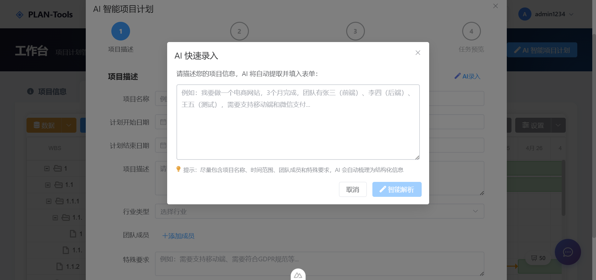
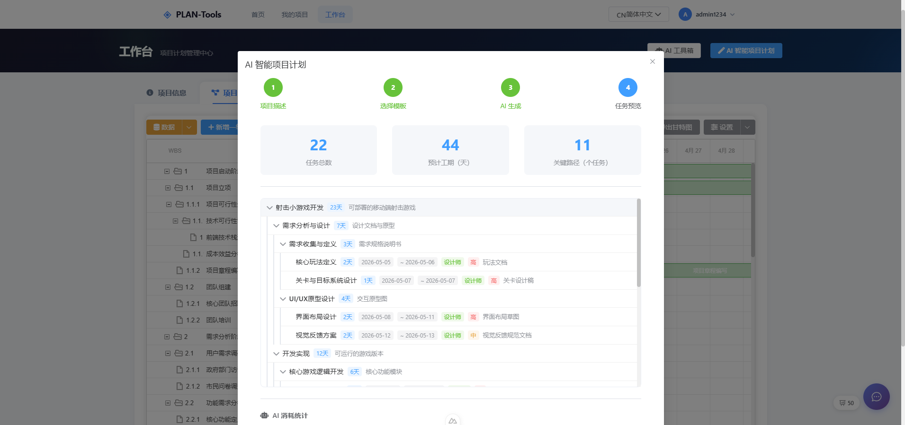
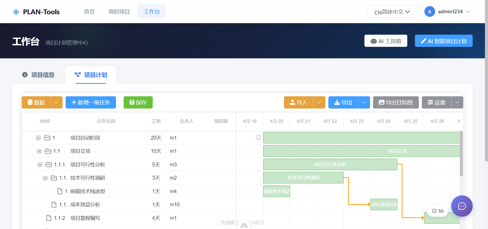
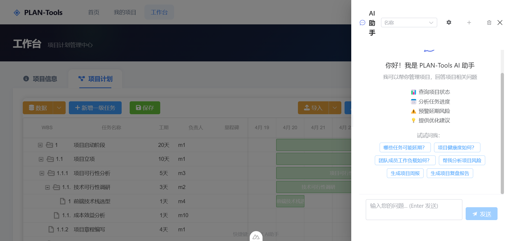
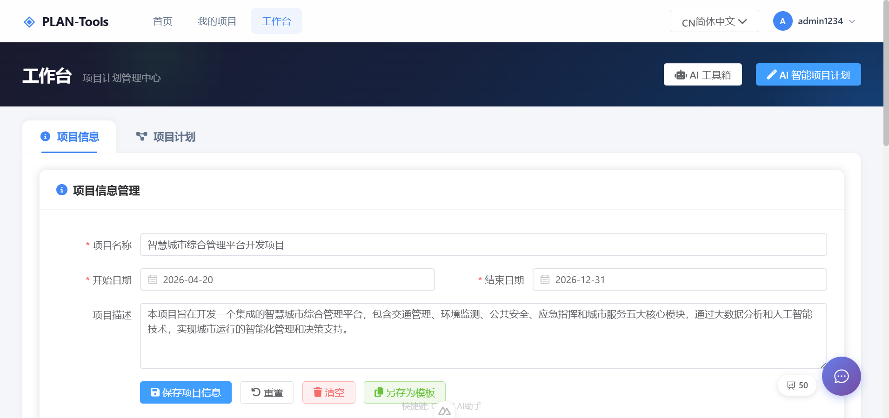

# PLAN-Tools - AI 驱动的项目计划管理软件


**AI 科学计划，赢在起点 — 一句话描述要做的事情，AI 自动拆解任务、生成计划、输出甘特图**

[在线演示](http://120.26.107.17/aiplan) • [快速开始](#快速开始) • [功能特性](#功能特性) • [贡献指南](#贡献指南)

[English Version](./README.md)

***

## 项目简介

PLAN-Tools 是一个基于 Nuxt 3 全栈架构的 AI 驱动项目计划管理软件。它提供了完整的项目管理功能，包括 AI 智能任务分解、项目信息管理、任务计划编制和甘特图可视化展示。应用采用现代化推广首页（突出 AI 能力展示）和集成工作台（Tab 页签）设计，支持云端存储（PostgreSQL）和本地存储（localStorage）双模式，具备用户认证和项目分享功能。

> **V0.3 更新**：已从 Vue 3 + Vite 迁移至 Nuxt 3 全栈架构，集成了 AI 智能计划、用户认证、云端存储和项目分享能力。

## 演示截图

### 中文界面

#### AI项目计划管理

#### AI Project Plan Management


 









## 功能特性

### 🤖 AI 智能计划

- **AI 快速录入** - 用自然语言描述项目，AI 自动提取项目名称、时间、团队成员等关键信息，一键填入表单
- **AI 任务分解 (WBS)** - AI 生成多层级（3-4 层）工作分解结构，符合 SMART 原则
- **AI 对话助手** - 与 AI 交互对话，获取项目计划建议、任务推荐和风险分析
- **AI 报告生成** - 自动生成周报、月报、里程碑总结和项目复盘
- **AI 分析** - 工作量分析、延期风险评估、健康诊断和假设场景模拟
- **AI 智能建议** - 依赖关系建议、工期估算和操作确认
- **提示词模板管理** - 创建和管理自定义 AI 提示词模板
- **模板市场** - 浏览和应用社区项目模板

### 🔐 用户认证

- **注册与登录** - 基于 JWT 的安全用户注册和登录
- **令牌刷新** - 自动令牌刷新，无缝会话管理
- **路由保护** - 工作台和项目页面的认证路由守卫

### 🌍 多语言支持 (Internationalization)

- **中英文切换** - 支持中文和英文界面语言切换
- **默认语言** - 默认使用英文界面
- **持久化存储** - 语言选择自动保存，下次打开自动应用
- **完整国际化** - 所有界面元素、表单、对话框、消息提示均支持多语言
- **导出国际化** - 导出的 Excel、Markdown、CSV 文件使用当前选择的语言
- **动态切换** - 实时切换语言，无需刷新页面

### 📋 项目信息管理

- 项目基本信息管理（名称、开始/结束日期、描述）
- 项目团队成员管理（姓名、电话、邮箱、角色）
- 支持导入/导出项目信息（JSON、Excel 格式）
- 项目模板管理和应用

### ✅ 项目计划管理

- **层级任务结构** - 支持父子任务的树形结构（最多 4 层）
- **WBS 自动编号** - 自动生成工作分解结构编号
- **任务属性管理** - 名称、日期、工期、交付物、依赖关系
- **任务分配** - 从项目成员中选择任务负责人
- **优先级设置** - 高/中/低三个级别
- **状态跟踪** - 待办/进行中/已完成
- **任务操作** - 新增、编辑、删除、排序、层级调整
- **可自定义显示** - 用户可自定义显示的任务字段

### 📊 甘特图可视化

- 直观的任务时间线展示
- 支持拖拽调整任务时间和工期
- 任务依赖关系可视化（箭头连接）
- 配色方案自定义
- 支持导出为 PNG 图片

### 🔗 项目分享

- **分享甘特图** - 生成甘特图分享链接
- **分享任务列表** - 与外部用户分享项目任务列表
- **访问控制** - 分享令牌验证和管理

### 💾 数据导入/导出

- **JSON 格式** - 完整数据交换和备份
- **Excel 格式** - 与电子表格软件兼容
- **Markdown 格式** - 生成项目文档
- **PNG 格式** - 甘特图图片导出

### ☁️ 云端与本地存储

- **云端存储** - PostgreSQL 数据库 + Drizzle ORM，持久化云端存储
- **本地存储** - 浏览器 localStorage，支持离线使用
- **数据迁移** - 从本地存储无缝迁移至云端存储

## 技术栈

| 技术                                                            | 版本    | 说明                                   |
| ------------------------------------------------------------- | ----- | ------------------------------------ |
| [Nuxt 3](https://nuxt.com/)                                   | 3.16+ | 全栈 Vue.js 框架，支持 SSR/SSG              |
| [Vue 3](https://vuejs.org/)                                   | 3.5+  | 渐进式 JavaScript 框架，使用 Composition API |
| [Pinia](https://pinia.vuejs.org/)                             | 2.1+  | Vue 官方状态管理库                          |
| [Nuxt I18n](https://i18n.nuxtjs.org/)                         | 9.5+  | Nuxt 国际化模块                           |
| [Element Plus](https://element-plus.org/)                     | 2.6+  | 基于 Vue 3 的组件库，支持国际化                  |
| [Tailwind CSS](https://tailwindcss.com/)                      | 3.4+  | 实用优先的 CSS 框架                         |
| [dhtmlx-gantt](https://dhtmlx.com/docs/products/dhtmlxGantt/) | 8.0+  | 专业的 JavaScript 甘特图库                  |
| [PostgreSQL](https://www.postgresql.org/)                     | -     | 关系型数据库，用于云端存储                        |
| [Drizzle ORM](https://orm.drizzle.team/)                      | 0.45+ | TypeScript ORM，用于数据库操作               |
| [XLSX](https://www.npmjs.com/package/xlsx)                    | 0.18+ | Excel 文件处理库                          |
| [Day.js](https://day.js.org/)                                 | 1.11+ | 轻量级日期处理库                             |
| [Sortable.js](https://sortablejs.github.io/Sortable/)         | 1.15+ | 拖拽排序库                                |
| [Font Awesome](https://fontawesome.com/)                      | 6.5+  | 图标库                                  |
| [Marked](https://marked.js.org/)                              | 18+   | Markdown 解析器，用于 AI 对话渲染              |
| [Highlight.js](https://highlightjs.org/)                      | 11+   | 代码块语法高亮                              |
| [bcryptjs](https://www.npmjs.com/package/bcryptjs)            | 3+    | 密码哈希，用于用户认证                          |
| [jsonwebtoken](https://www.npmjs.com/package/jsonwebtoken)    | 9+    | JWT 令牌生成与验证                          |
| [html2canvas](https://html2canvas.hertzen.com/)               | 1.4+  | HTML 转画布截图                           |

## 快速开始

### 环境要求

- Node.js >= 16.0.0
- npm >= 8.0.0 或 pnpm >= 7.0.0
- PostgreSQL（云端存储模式）

### 安装依赖

```bash
# 使用 npm
npm install

# 或使用 pnpm
pnpm install
```

### 配置环境

复制示例环境文件并配置：

```bash
cp .env.example .env
```

编辑 `.env` 配置：

- 数据库连接（PostgreSQL）
- AI 服务商和 API Key
- JWT 密钥

### 数据库初始化

```bash
# 生成数据库 Schema
npm run db:generate

# 执行迁移
npm run db:migrate

# 或直接推送 Schema
npm run db:push

# 初始化种子数据（可选）
npm run db:seed
```

### 启动开发服务器

```bash
npm run dev
```

应用将在 <http://localhost:3000> 启动。

### 构建生产版本

```bash
npm run build
```

构建产物将输出到 `.output/` 目录。

### 预览生产构建

```bash
npm run preview
```

### 运行测试

```bash
# E2E 测试
npm run test:e2e

# E2E 测试（带 UI）
npm run test:e2e:ui

# E2E 测试（显示浏览器）
npm run test:e2e:headed
```

### 代码质量

```bash
# ESLint 检查并自动修复
npm run lint

# Prettier 格式化
npm run format
```

## 项目结构

```
PLAN-Tools/
├── docs/                      # 项目文档和截图
├── i18n/                      # 国际化配置
│   ├── i18n.config.ts        # i18n 运行时配置
│   └── locales/              # 翻译文件
│       ├── zh-CN.json        # 中文翻译
│       └── en.json           # 英文翻译
├── server/                    # Nuxt Server Routes (API)
│   └── api/                  # API 接口
│       ├── ai/               # AI 相关接口（WBS、对话、报告、分析）
│       ├── auth/             # 认证接口（登录、注册、刷新令牌）
│       ├── migrate/          # 数据迁移接口（本地到云端）
│       ├── projects/         # 项目 CRUD 接口（含成员、任务、分享）
│       ├── share/            # 项目分享接口
│       └── templates/        # 项目模板和提示词模板接口
├── src/
│   ├── assets/                # 静态资源
│   │   └── main.css          # 全局样式
│   ├── components/            # Vue 组件
│   │   ├── AIAssistant/      # AI 助手组件
│   │   │   ├── AIChatDrawer.vue       # AI 对话抽屉
│   │   │   ├── AIProjectWizard.vue    # AI 项目创建向导
│   │   │   ├── AIQuickInputDialog.vue # AI 快速录入对话框
│   │   │   ├── AIReportDialog.vue     # AI 报告生成
│   │   │   ├── AIFloatingButton.vue   # AI 浮动按钮
│   │   │   ├── PromptTemplateManager.vue  # 提示词模板管理
│   │   │   └── TemplateMarket.vue     # 模板市场
│   │   ├── ProjectInfo/      # 项目信息管理组件
│   │   │   ├── ProjectInfoForm.vue
│   │   │   ├── MemberManager.vue
│   │   │   └── ProjectTemplateManager.vue
│   │   ├── ProjectPlan/      # 项目计划管理组件
│   │   │   ├── Toolbar.vue
│   │   │   ├── TaskList.vue
│   │   │   ├── TaskForm.vue
│   │   │   ├── DisplaySettingsDialog.vue
│   │   │   └── GanttColumnSettingsDialog.vue
│   │   ├── GanttChart/       # 甘特图组件
│   │   │   ├── GanttChart.client.vue
│   │   │   └── GanttColorSchemeDialog.vue
│   │   ├── Share/            # 分享组件
│   │   │   ├── ShareGanttChart.client.vue
│   │   │   ├── ShareManager.vue
│   │   │   └── ShareTaskList.vue
│   │   ├── Migration/        # 数据迁移
│   │   │   └── DataMigrationDialog.vue
│   │   └── common/           # 通用组件
│   │       ├── LanguageSwitcher.vue
│   │       ├── EmptyState.vue
│   │       └── SkeletonLoader.vue
│   ├── composables/           # Nuxt 组合式函数
│   │   ├── useAI.ts          # AI 服务组合式函数
│   │   └── useKeyboardShortcuts.ts
│   ├── layouts/              # Nuxt 布局
│   │   └── default.vue       # 默认布局（含导航栏）
│   ├── pages/                # Nuxt 页面（自动路由）
│   │   ├── index.vue         # 推广首页（AI 能力展示）
│   │   ├── login.vue         # 登录页
│   │   ├── register.vue      # 注册页
│   │   ├── projects.vue      # 项目列表页
│   │   ├── workspace.vue     # 工作台（默认）
│   │   ├── workspace/[id].vue # 指定项目工作台
│   │   └── share/[token].vue # 分享项目查看页
│   ├── plugins/              # Nuxt 插件
│   │   └── auth.client.ts    # 认证插件
│   ├── store/                # Pinia 状态管理
│   │   ├── auth.ts           # 认证状态
│   │   ├── chat.ts           # AI 对话状态
│   │   ├── project.ts        # 项目信息状态
│   │   ├── tasks.ts          # 任务状态
│   │   └── ui.ts             # UI 状态
│   └── utils/                # 工具函数
│       ├── export.ts         # 数据导出（支持国际化）
│       ├── import.ts         # 数据导入
│       ├── wbs.ts            # WBS 编号生成
│       ├── date.ts           # 日期处理
│       ├── tasks.ts          # 任务辅助函数
│       └── mockHelper.ts     # 模拟数据辅助
├── nuxt.config.ts            # Nuxt 配置
├── tsconfig.json             # TypeScript 配置
├── package.json              # 项目配置
└── README.md                 # 项目说明
```

## 核心功能说明

### AI 集成

项目通过服务端 API 接口集成 AI 能力：

- **`/api/ai/wbs`** - AI 驱动的工作分解结构生成（3-4 层深度）
- **`/api/ai/parse-project`** - 自然语言项目信息提取
- **`/api/ai/chat`** & **`/api/ai/chat-stream`** - 交互式 AI 对话（支持流式输出）
- **`/api/ai/generate-weekly-report`** - 周报生成
- **`/api/ai/generate-monthly-report`** - 月报生成
- **`/api/ai/generate-milestone-summary`** - 里程碑总结生成
- **`/api/ai/generate-project-review`** - 项目复盘生成
- **`/api/ai/analyze-workload`** - 工作量分析
- **`/api/ai/analyze-delay-risk`** - 延期风险评估
- **`/api/ai/health-diagnosis`** - 项目健康诊断
- **`/api/ai/what-if`** - 假设场景模拟
- **`/api/ai/suggest-dependencies`** - 任务依赖建议
- **`/api/ai/estimate-duration`** - 工期估算
- **`/api/ai/confirm-action`** - AI 操作确认
- **`/api/ai/execute-action`** - AI 操作执行
- **`/api/ai/smart-chat`** - 智能对话（含操作执行）

### 认证系统

基于 JWT 的用户认证：

- 用户注册和登录
- 令牌自动刷新机制
- 认证插件路由保护
- bcrypt 密码哈希

### 状态管理

项目使用 Pinia 进行状态管理，包含五个核心 store：

- **`store/auth.ts`** - 管理用户认证状态
- **`store/chat.ts`** - 管理 AI 对话状态
- **`store/project.ts`** - 管理项目基本信息和团队成员
- **`store/tasks.ts`** - 管理任务树和显示设置
- **`store/ui.ts`** - 管理 UI 状态（分割面板比例、语言设置等）

### 数据持久化

双存储模式：

- **云端模式** - PostgreSQL 数据库 + Drizzle ORM，完整 CRUD API
- **本地模式** - 浏览器 localStorage，支持离线使用
  - `plan-tools-project` - 项目信息和团队成员
  - `plan-tools-tasks` - 任务数据和显示设置
  - `plan-tools-ui` - UI 状态配置
  - `plan-tools-locale` - 用户选择的语言偏好

### WBS 编号规则

WBS（工作分解结构）编号自动生成，格式如下：

```
1         # 顶级任务
1.1       # 二级任务
1.1.1     # 三级任务
1.1.1.1   # 四级任务
2         # 另一个顶级任务
2.1       # 2 的子任务
```

## 使用指南

### AI 智能创建项目

1. 在首页或工作台点击 **AI 智能计划**
2. 用自然语言描述项目（如"3个月做一个电商网站，团队3人"）
3. AI 自动提取项目信息并生成多层级任务计划
4. 审核和调整生成的计划
5. 保存并开始管理

### 切换界面语言

1. 在页面顶部导航栏找到语言切换器
2. 点击语言选择器，选择：
   - 🇺🇸 English - 切换到英文界面
   - 🇨🇳 中文 - 切换到中文界面
3. 语言选择会自动保存，下次打开应用时使用该语言
4. 导出的 Excel、Markdown、CSV 文件会使用当前选择的语言

### 创建新项目

1. 访问 **项目信息管理** 页面
2. 填写项目基本信息（名称、日期、描述）
3. 添加项目团队成员
4. 保存项目信息

### 编制项目计划

1. 访问 **项目计划管理** 页面
2. 点击 **新增任务** 创建任务，或使用 **AI 智能计划** 自动生成
3. 填写任务信息：
   - 任务名称
   - 开始/结束日期或工期
   - 交付物
   - 任务依赖
   - 负责人
   - 优先级和状态
4. 使用 **层级调整** 按钮创建父子任务关系
5. 使用 **排序** 按钮调整任务顺序
6. 点击 **保存** 生成 WBS 编号

### 分享项目

1. 在工作台打开分享管理器
2. 生成甘特图或任务列表的分享链接
3. 将链接分享给外部用户
4. 随时管理和撤销分享权限

### 导出项目

项目支持多种导出格式：

- **JSON** - 完整项目数据备份
- **Excel** - 生成电子表格
- **Markdown** - 生成项目文档
- **PNG** - 导出甘特图图片

## 在线演示

访问 <http://120.26.107.17/aiplan> 查看在线演示。

## 浏览器支持

| 浏览器     | 支持版本  |
| ------- | ----- |
| Chrome  | 最新版 ✅ |
| Firefox | 最新版 ✅ |
| Safari  | 最新版 ✅ |
| Edge    | 最新版 ✅ |

## 开发指南

详细的开发指南请参阅 [docs/DEVELOPMENT-GUIDE.md](docs/DEVELOPMENT-GUIDE.md)

### 添加新功能

1. 在对应组件中添加 UI
2. 在 store 中添加状态管理
3. 如需要，在 server/api 中添加 API 接口
4. 如需要，在 utils 中添加工具函数
5. 更新文档

### 代码规范

项目使用 ESLint 和 Prettier 进行代码检查和格式化：

```bash
# 自动修复代码问题
npm run lint

# 格式化代码
npm run format
```

## 贡献指南

欢迎提交 Issue 和 Pull Request！

### 提交 Issue

请在 Issue 中详细描述：

- Bug 复现步骤
- 预期行为和实际行为
- 截图（如适用）
- 环境信息（浏览器、操作系统等）

### 提交 Pull Request

1. Fork 本项目
2. 创建特性分支 (`git checkout -b feature/AmazingFeature`)
3. 提交更改 (`git commit -m 'Add some AmazingFeature'`)
4. 推送到分支 (`git push origin feature/AmazingFeature`)
5. 创建 Pull Request

## ☕ 请我喝杯咖啡

如果您觉得这个项目对您有帮助，欢迎请我喝杯咖啡！您的支持是我持续开发和维护项目的动力。


<br />

### 支付宝打赏


**感谢您的支持！** 🙏

<br />

## 许可证

本项目采用 **AGPL3.0**[ ](LICENSE)许可证。

如计划商业使用，或定制化功能，务必联系我们获取书面授权，避免法律风险 ‌‌。

***

**Made with ❤️ by the PLAN-Tools team**

[⬆ 返回顶部](#plan-tools---ai-驱动的项目计划管理软件)
