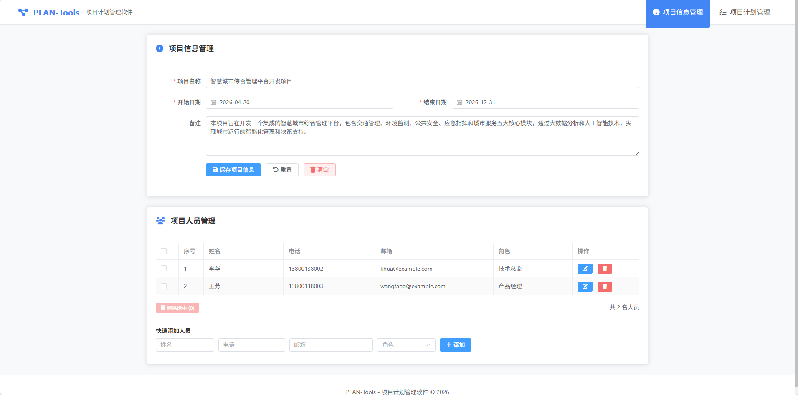
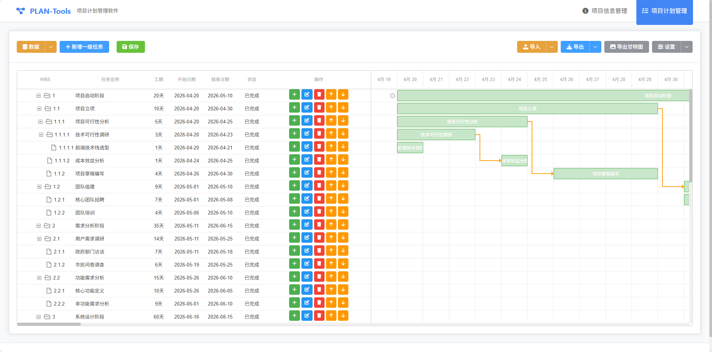

# PLAN-Tools - Project Management Tool

<br />


**A powerful frontend project management tool with project information management, task planning, and Gantt chart visualization**

[Live Demo](http://120.26.107.17/pt1) • [Quick Start](#quick-start) • [Features](#features) • [Contributing](#contributing)

[中文文档](./README.md)

<br />

***

## Introduction

PLAN-Tools is a pure frontend project management application that requires no backend service. It provides comprehensive project management features including project information management, task planning, and Gantt chart visualization. All data is stored in the browser's localStorage, ensuring data security and ease of management.

## Screenshots

### Project Information Management



### Gantt Chart Visualization



## Features

### 📋 Project Information Management

- Basic project information management (name, start/end dates, description)
- Team member management (name, phone, email, role)
- Import/export project information (JSON, Excel formats)

### ✅ Project Planning

- **Hierarchical Task Structure** - Tree structure with parent-child tasks
- **Auto WBS Numbering** - Automatic Work Breakdown Structure numbering
- **Task Properties** - Name, dates, duration, deliverables, dependencies
- **Task Assignment** - Assign tasks from project members
- **Priority Levels** - High/Medium/Low
- **Status Tracking** - Todo/In Progress/Completed
- **Task Operations** - Add, edit, delete, reorder, adjust hierarchy
- **Customizable Display** - User can customize visible task fields

### 📊 Gantt Chart Visualization

- Intuitive task timeline display
- Drag-and-drop task scheduling
- Visual task dependencies (arrows)
- Export to PNG image

### 💾 Import/Export

- **JSON Format** - Complete data exchange and backup
- **Excel Format** - Spreadsheet compatibility
- **Markdown Format** - Project documentation
- **PNG Format** - Gantt chart image export

## Tech Stack

| Technology                                                    | Version | Description                                           |
| ------------------------------------------------------------- | ------- | ----------------------------------------------------- |
| [Vue 3](https://vuejs.org/)                                   | 3.4+    | Progressive JavaScript framework with Composition API |
| [Vite](https://vitejs.dev/)                                   | 5.2     | Next generation frontend build tool                   |
| [Pinia](https://pinia.vuejs.org/)                             | 2.1+    | Vue official state management library                 |
| [Vue Router](https://router.vuejs.org/)                       | 4.3+    | Vue.js official router                                |
| [Element Plus](https://element-plus.org/)                     | 2.6+    | Vue 3 component library                               |
| [Tailwind CSS](https://tailwindcss.com/)                      | 3.4+    | Utility-first CSS framework                           |
| [dhtmlx-gantt](https://dhtmlx.com/docs/products/dhtmlxGantt/) | 8.0+    | Professional JavaScript Gantt chart library           |
| [XLSX](https://www.npmjs.com/package/xlsx)                    | 0.18+   | Excel file processing library                         |
| [Day.js](https://day.js.org/)                                 | 1.11+   | Lightweight date manipulation library                 |
| [Sortable.js](https://sortablejs.github.io/Sortable/)         | 1.15+   | Drag-and-drop sorting library                         |
| [Font Awesome](https://fontawesome.com/)                      | 6.5+    | Icon library                                          |

## Quick Start

### Prerequisites

- Node.js >= 16.0.0
- npm >= 8.0.0 or pnpm >= 7.0.0

### Install Dependencies

```bash
# Using npm
npm install

# Or using pnpm
pnpm install
```

### Start Development Server

```bash
npm run dev
```

The application will start at <http://localhost:5173> and open in your browser automatically.

### Build for Production

```bash
npm run build
```

Build artifacts will be stored in the `dist/` directory.

### Preview Production Build

```bash
npm run preview
```

### Run Tests

```bash
# Manual testing
# Open tests/test-iframe.html in browser and click "Run All Tests"

# Unit tests
npm run test:unit

# E2E tests
npm run test:e2e
```

For detailed testing guide, please refer to [tests/TESTING.md](tests/TESTING.md)

### Code Quality

```bash
# ESLint check and auto-fix
npm run lint

# Prettier format
npm run format
```

## Project Structure

```
PLAN-Tools/
├── docs/                      # Project documentation and screenshots
│   ├── run_pic.png            # Demo screenshot
│   ├── run_pic2.png           # Gantt chart screenshot
│   ├── alipay.png             # Alipay QR code
│   └── ...
├── tests/                     # Test files
│   ├── TESTING.md             # Test report
│   ├── MANUAL-TEST.md         # Manual test guide
│   ├── test-iframe.html       # Quick test page
│   ├── test-suite.html        # Test suite
│   ├── test-app.cjs           # Node.js test script
│   ├── test-app.py            # Python test script
│   └── ...                    # Other test utilities
├── src/
│   ├── assets/                # Static assets
│   │   └── main.css          # Global styles
│   ├── components/            # Vue components
│   │   ├── ProjectInfo/      # Project info components
│   │   ├── ProjectPlan/      # Project plan components
│   │   ├── GanttChart/       # Gantt chart components
│   │   └── common/           # Common components
│   ├── data/                 # Mock data
│   ├── router/               # Route configuration
│   ├── store/                # Pinia state management
│   ├── utils/                # Utility functions
│   ├── views/                # Page views
│   ├── App.vue               # Root component
│   └── main.js               # Application entry
├── .eslintrc.js              # ESLint configuration
├── .prettierrc               # Prettier configuration
├── .gitignore                # Git ignore configuration
├── index.html                # HTML entry
├── package.json              # Project configuration
├── tailwind.config.js        # Tailwind CSS configuration
├── vite.config.js            # Vite configuration
└── README.md                 # Project description
```

## Core Features

### State Management

The project uses Pinia for state management with three core stores:

- **`store/project.js`** - Project basic information and team members
- **`store/tasks.js`** - Task tree and display settings
- **`store/ui.js`** - UI state (split pane ratio, etc.)

### Data Persistence

All data is automatically saved to browser's localStorage:

- `plan-tools-project` - Project information and team members
- `plan-tools-tasks` - Task data and display settings
- `plan-tools-ui` - UI state configuration

### WBS Numbering Rules

WBS (Work Breakdown Structure) numbers are automatically generated:

```
1         # Top-level task
1.1       # Second-level task
1.1.1     # Third-level task
2         # Another top-level task
2.1       # Child of task 2
```

## Usage Guide

### Create a New Project

1. Visit **Project Information Management** page
2. Fill in project basic information (name, dates, description)
3. Add project team members
4. Save project information

### Create Project Plan

1. Visit **Project Plan Management** page
2. Click **Add Task** to create a task
3. Fill in task information:
   - Task name
   - Start/end dates or duration
   - Deliverables
   - Task dependencies
   - Assignee
   - Priority and status
4. Use **Level Adjustment** buttons to create parent-child relationships
5. Use **Reorder** buttons to adjust task order
6. Click **Save** to generate WBS numbers

### Export Project

The project supports multiple export formats:

- **JSON** - Complete project data backup
- **Excel** - Generate spreadsheet
- **Markdown** - Generate project documentation
- **PNG** - Export Gantt chart as image

## Live Demo

Visit <http://120.26.107.17/pt1> to see the live demo.

## Browser Support

| Browser | Supported Version |
| ------- | ----------------- |
| Chrome  | Latest ✅          |
| Firefox | Latest ✅          |
| Safari  | Latest ✅          |
| Edge    | Latest ✅          |

## Development Guide

For detailed development guide, please refer to [docs/DEVELOPMENT-GUIDE.md](docs/DEVELOPMENT-GUIDE.md)

### Adding New Features

1. Add UI in corresponding components
2. Add state management in store
3. Add utility functions if needed
4. Update documentation

### Code Standards

The project uses ESLint and Prettier for code checking and formatting:

```bash
# Auto-fix code issues
npm run lint

# Format code
npm run format
```

## Contributing

Issues and Pull Requests are welcome!

### Submitting Issues

Please include in your Issue:

- Steps to reproduce the bug
- Expected and actual behavior
- Screenshots (if applicable)
- Environment information (browser, OS, etc.)

### Submitting Pull Requests

1. Fork this project
2. Create feature branch (`git checkout -b feature/AmazingFeature`)
3. Commit changes (`git commit -m 'Add some AmazingFeature'`)
4. Push to branch (`git push origin feature/AmazingFeature`)
5. Create Pull Request

## Sponsor

If you find this project helpful, consider buying me a coffee! ☕

Your support helps me continue developing and maintaining this project.

[](./docs/alipay.png)

## License

This project is licensed under the [MIT](LICENSE) License.

## Contact

For questions or suggestions, feel free to reach out:

- Submit an [Issue](https://github.com/yourusername/PLAN-Tools/issues)
- Send email to <your.email@example.com>

***

<br />

**Made with ❤️ by the PLAN-Tools team**

[⬆ Back to Top](#plan-tools---project-management-tool)

